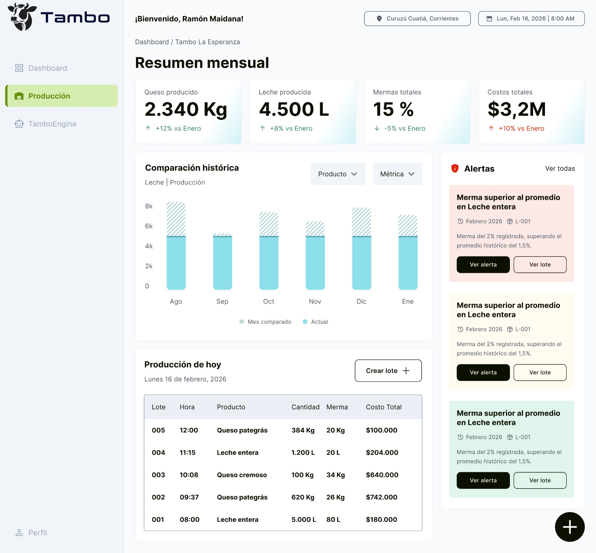
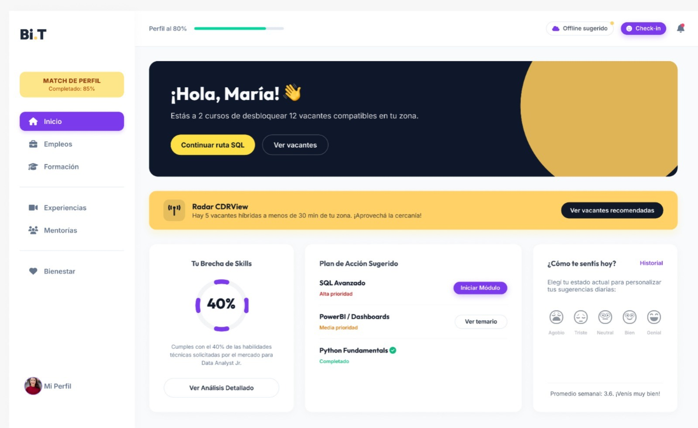
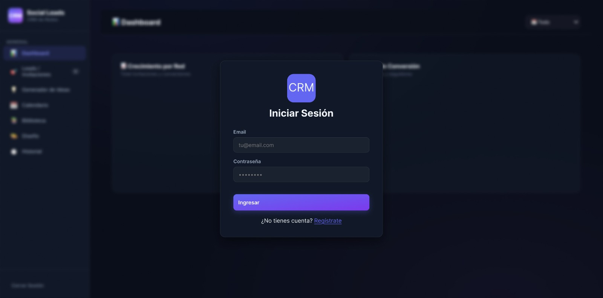

# Lorena Paola Sartori | Product Lab

## Product Project Manager · Producto · Proyectos · Calidad

Conecto equipos, necesidades de usuario y objetivos de negocio para convertir problemas en productos que puedan construirse, validarse y evolucionar.

[](https://www.linkedin.com/in/lorena-paola-sartori-pm/)
[](https://github.com/Anonimus201990)
[](./documento/lorena-paola-sartori.pdf)
[](https://anonimus201990.github.io/Mi-porfolio-web)

---

## Entrega

- **Repositorio público:** [github.com/Anonimus201990/Mi-porfolio-web](https://github.com/Anonimus201990/Mi-porfolio-web)
- **Sitio desplegado:** [anonimus201990.github.io/Mi-porfolio-web](https://anonimus201990.github.io/Mi-porfolio-web)

## Sobre mí

Soy Product Project Manager y trabajo en la intersección entre producto, proyectos, equipos, usuario y calidad. Mi recorrido comenzó en QA y evolucionó hacia la gestión de proyectos y productos digitales. Combino discovery, priorización y ejecución para reducir incertidumbre y ayudar a los equipos a entregar valor con calidad.

## Competencias


## Tecnologías de este portfolio


## Proyectos destacados

### [Tambo360](./pages/proyectos.html#tambo360)



**Proyecto profesional · Product Project Management:** SaaS B2B para productores de leche. El trabajo de Product Discovery y definición inicial del MVP busca convertir información operativa en apoyo para la toma de decisiones. El portfolio documenta una estructura funcional inicial del MVP.

### [BiT](./pages/proyectos.html#bit)



**Proyecto profesional · Product Project Management:** Participación en un producto digital con foco en integrar calidad al trabajo y a las decisiones de producto, considerando necesidades de usuario, riesgo y valor.

### [CRM + IA](./pages/proyectos.html#crm-ia)



**Proyecto personal · Product y Project Management:** Exploración de IA aplicada a la organización del trabajo y la trazabilidad: identificación del problema, definición de la solución y experimentación con IA. El proyecto documenta un prototipo funcional.

## Contacto

- **LinkedIn:** [linkedin.com/in/lorena-paola-sartori-pm](https://www.linkedin.com/in/lorena-paola-sartori-pm/)
- **GitHub:** [github.com/Anonimus201990](https://github.com/Anonimus201990)
- **CV:** [Descargar PDF](./documento/lorena-paola-sartori.pdf)

## Ver el portfolio

Cloná el repositorio y abrí `index.html` en el navegador. También podés usar la extensión **Live Server** de VS Code. Bootstrap 5.3.3 y las insignias se cargan desde CDN, por lo que se necesita conexión a internet.

```bash
git clone https://github.com/Anonimus201990/Mi-porfolio-web.git
cd Mi-porfolio-web
```

### Estructura del proyecto

```text
Mi-porfolio-web/
├── index.html
├── README.md
├── documento/
│   └── lorena-paola-sartori.pdf
├── imagenes/
│   ├── logo-lorena-paola-sartori.png
│   ├── hero.png
│   └── capturas de proyectos y recursos visuales
├── pages/
│   ├── sobre-mi.html
│   ├── proyectos.html
│   ├── como-trabajo.html
│   ├── ideas-recursos.html
│   └── contacto.html
└── style/
    └── styles.css
```
